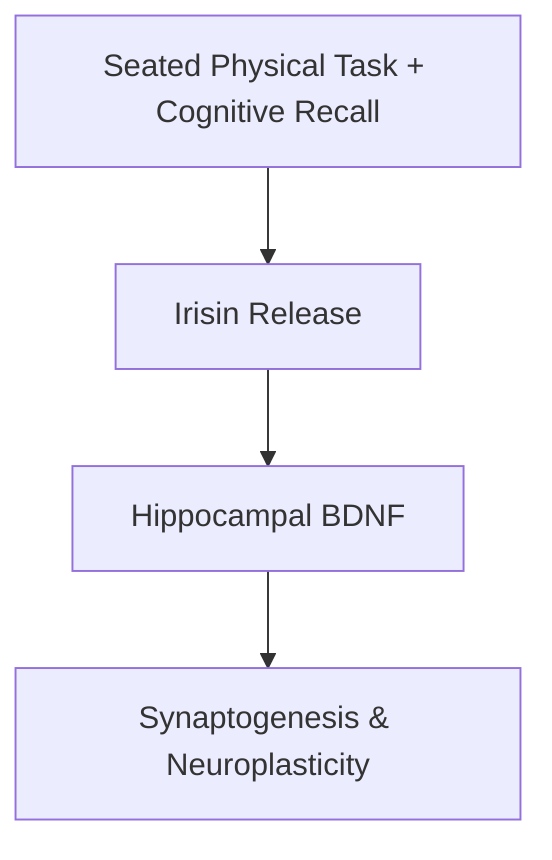
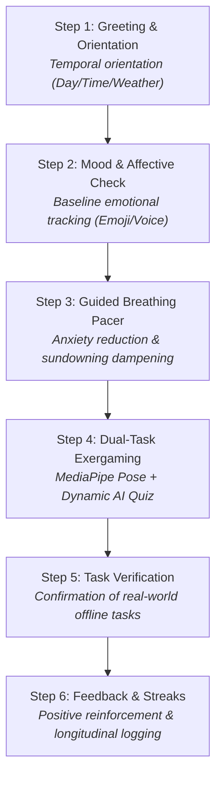
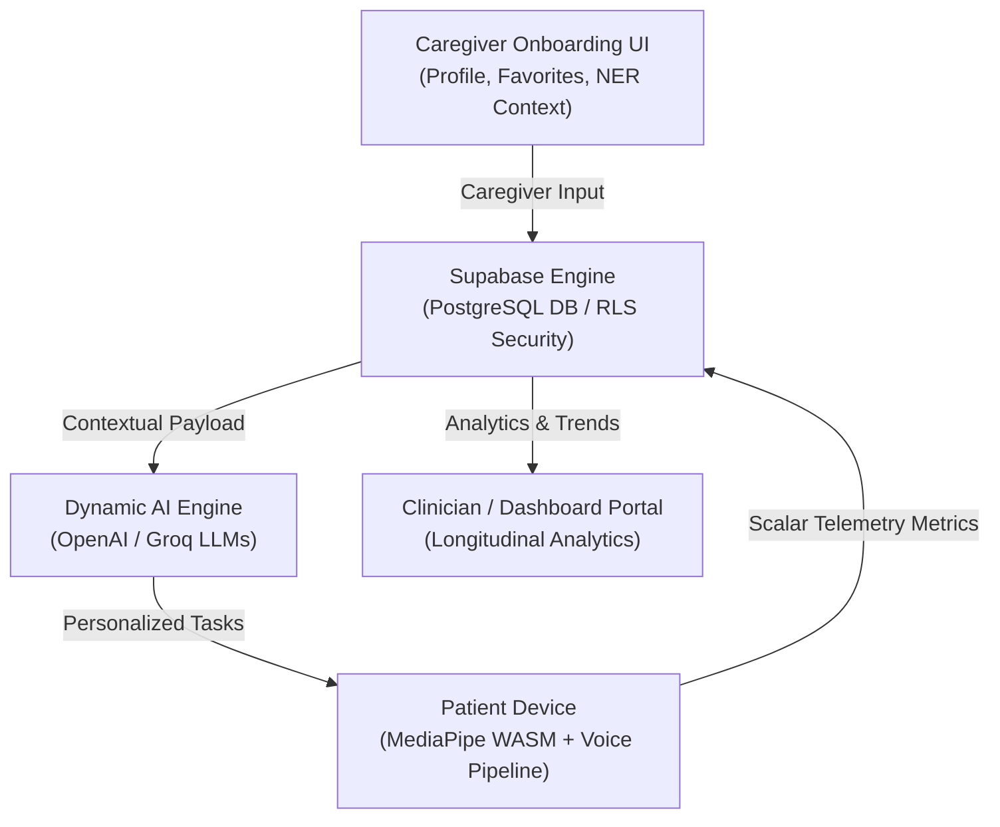

```
# COGNIA | SIH 2026

> **Privacy-First Dual-Task Exergaming & Person-Centered Cognitive Therapy Platform for Dementia Care**  
> *Developed for the Smart India Hackathon (SIH) 2026 — Team Elite Control*

---

## 📌 Project Overview

**COGNIA** is a web-based digital therapeutic platform engineered to mitigate cognitive decline in patients with Mild Cognitive Impairment (MCI) and early-to-moderate Dementia. By integrating **Dual-Task Exergaming** with **Kitwood’s Person-Centered Care Framework**, COGNIA combines real-time seated physical movement tracking with dynamic cognitive recall exercises.

Designed specifically to address accessibility gaps in regional demographics—including the North Eastern Region (NER) of India—COGNIA eliminates static clinical repetition through dynamic LLM-driven prompt generation, client-side computer vision, and hands-free voice interaction.

---

## ⚡ Key Features

* **Dual-Task Exergaming:** Simultaneously engages physical motor execution (seated exercises) and cognitive recall to stimulate neuroplasticity and BDNF production.
* **Deterministic 6-Step Session Loop:** A structured Next.js state machine that eliminates navigation friction and prevents patient disorientation.
* **100% On-Device Pose Tracking:** Utilizes MediaPipe WebAssembly (WASM) to process video frames frame-by-frame inside local browser RAM—video data never touches a server.
* **Dynamic AI Prompt Generation:** Uses contextual LLM seeding (OpenAI / Groq) infused with caregiver-provided patient history, NER regional culture, and daily routines.
* **Anti-Repetition Engine:** Implements dynamic seed routing and anti-caching headers (`Cache-Control: no-store`) to ensure non-repetitive, fresh interactions every session.
* **Multimodal Voice Interface:** Powered by Deepgram Aura (TTS) and Groq Whisper v3 (STT) with native Web Speech API fallback for hands-free interaction.
* **Caregiver & Clinician Dashboard:** Real-time longitudinal telemetry tracking accuracy trends, reaction times, and self-reported mood indexes over 12-week cycles.

---

## 🧠 Clinical & Neurobiological Foundation



1. **BDNF & Synaptogenesis:** Physical movement releases muscle-derived irisin, stimulating **Brain-Derived Neurotrophic Factor (BDNF)** in the hippocampus. Concurrent cognitive stimulation forces newly formed neurons into active neural circuits.
2. **Tom Kitwood’s Personhood Framework:** Replaces rigid clinical exams (like standard MMSE/MoCA tests) with personalized identity anchors—wrapping arithmetic, recall, and matching exercises inside familiar household and regional context.
3. **Zero Fall-Risk Design:** All physical interactions are calibrated strictly for seated execution (head tilts, arm raises, upper-body posture alignment).

---

## 🔄 The 6-Step Daily Session Flow



---

## 🏗 System Architecture



---

## 🛡 Privacy & Security Architecture

* **Zero-Video-Retention (ZVR):** Webcams process landmark coordinates locally. Video streams are purged immediately from RAM frame-by-frame. No video files or images are ever stored or uploaded.
* **Data Minimization:** Only scalar, anonymized performance indicators (accuracy percentage, reaction speed in milliseconds, session timestamp, mood index) are stored in the database.
* **Row Level Security (RLS):** Patient records in PostgreSQL are isolated per caregiver/institution using cryptographic user-ID authentication policies.
* **Regulatory Alignment:** Designed in compliance with India's **Digital Personal Data Protection (DPDP) Act** and medical disclaimers as a non-diagnostic cognitive therapeutic companion.

---

## 🛠 Tech Stack

| Domain | Technology | Purpose |
| --- | --- | --- |
| **Frontend Framework** | Next.js (App Router), React | Application architecture & state machine management |
| **Styling & UI** | Tailwind CSS v4 / Lucide | High-contrast, accessible UI design |
| **Computer Vision** | MediaPipe Pose (WASM) | Client-side 33-landmark 3D skeletal tracking |
| **Voice Processing** | Deepgram Aura / Groq Whisper v3 | Natural TTS synthesis & hands-free STT recognition |
| **High Availability** | Web Speech API | Browser-native zero-latency audio fallback |
| **AI Generation** | Google AI / Groq LLMs | Dynamic, context-injected prompt generation |
| **Database & Auth** | Supabase (PostgreSQL) | Secure cloud telemetry storage & Row Level Security |
| **Deployment** | Vercel | Edge rendering and zero-latency routing |

---

## 🚀 Getting Started

### Prerequisites

* Node.js (v18.0.0 or higher)
* npm, yarn, or pnpm
* Modern web browser with webcam and microphone permissions (Chrome/Edge recommended)

### Installation

1. **Clone the repository:**
```bash
git clone [https://github.com/your-username/cognia-sih2026.git](https://github.com/your-username/cognia-sih2026.git)
cd cognia-sih2026

```


2. **Install dependencies:**
```bash
npm install

```


3. **Configure Environment Variables:**
Create a `.env.local` file in the root directory:
```env
# Supabase Configuration
NEXT_PUBLIC_SUPABASE_URL=[https://your-supabase-project.supabase.co](https://your-supabase-project.supabase.co)
NEXT_PUBLIC_SUPABASE_ANON_KEY=your-supabase-anon-key
SUPABASE_SERVICE_ROLE_KEY=your-supabase-service-role-key

# AI LLM Provider Configuration
OPENAI_API_KEY=your-openai-api-key
GROQ_API_KEY=your-groq-api-key

# Voice Provider Configuration
DEEPGRAM_API_KEY=your-deepgram-api-key

# Application Settings
NEXT_PUBLIC_APP_URL=http://localhost:3000

```


4. **Run the development server:**
```bash
npm run dev

```


5. **Access the application:**
Open [http://localhost:3000](http://localhost:3000) in your browser.

---

## 💼 Business & Scaling Model (B2B SaaS)

COGNIA operates a hybrid model focused on scalable enterprise deployment:

* **B2C Caregiver Subscription:** Direct access for individual families to run daily routines at home.
* **B2B Institutional Licensing:** Enterprise tier for **Memory Care Clinics, Rehabilitation Centers, and Neurology Departments**, providing:
* Multi-patient centralized management portals.
* Longitudinal progression telemetry and automated PDF clinical trend exports.
* Custom API integrations with Electronic Health Record (EHR) systems.


---

## 👥 Team Details — Elite Control (SIH 2026)

* **Project:** COGNIA — Privacy-First Dual-Task Exergaming Platform
* **Event:** Smart India Hackathon (SIH) 2026
* **Category:** Healthcare & Digital Therapeutics / Software

---

## 📄 License

This project is developed for evaluation under the **Smart India Hackathon 2026**. All rights reserved.

```

```
